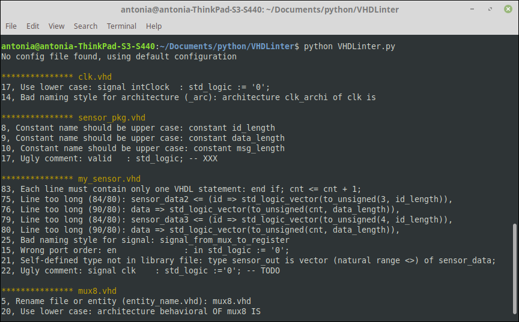

# VHDLint

## Table of contents
* [General info](#general-info)
* [How to Use](#setup)
* [Features](#features)
* [Preview](#preview)
* [To Do](#to-do)
* [Source](#source)

## General info
VHDLint is a small linter for the VHDL language, which looks for programming errors and helps enforcing a coding standard.

## How to Use
Save the repository folder in the same directory like your VHDL design files. To launch the app, open the *VHDLint.py* script via the console.
If the repository folder is not in the same directory like your VHDL files, the configuration settings in *config.py* may be edited.

## Features
VHDLint supports code check and formatting options for VHDL Design Files (.vhd). 
The following naming and coding conventions are supported:

#### General
- [x] VHDL file name and entity name should be similar, like *entityname.vhd*
- [x] Source code must not exceed 80 characters per line
- [x] Each line must contain only one VHDL statement
- [x] No TAB characters should be used for indentation
- [ ] Each line must be properly indented with 2 spaces per level of indentation
- [x] Source code has to be written in lower case, except for constant declarations

#### Signals, Variables and Constants
- [x] Signal and variable names must not exceed 24 characters
- [x] Vector range should be *msb downto lsb*
- [x] Constants should be written in upper-case

#### Entities
- [ ] The functionality of an entity should be commented
- [x] Ports shoud be ordered by their type (in, out)
- [ ] If generics are preset, their function should be commented

#### Architectures
- [x] The arcitecture name is derived from the entity name by suffixing it with *_arc*
- [ ] Port maps and generic maps should use named association
- [ ] Maps should contain only one port or generic per line

#### Packages
- [x] Package should be indicated by suffixing *_pkg* to their name
- [X] Self-defined types (except for FSM) should be defined in a library
- [ ] All defined types that are in the package should be commented

## Preview

## To Do
Some ideas to improve the functionality:
* Support more features!
* Add configuration settings
* Support multiple directories
* Ignore lines with ignore comment
* Implement code rating ?
* GUI ?

## Source
The functionality is based on the idea of having something like *Pylint* for VHDL code; *VHDLint*.
The suported checks for the listed coding conventions in VHDL follow suggestions in [**VHDL coding style**](http://www.tkt.cs.tut.fi/kurssit/1212/S08/Harjoitukset/vhdl_coding.html) by Tampere University of Technology and [**VHDL Style Guide**](https://www.ims-chips.de/content/pdftext/VHDL_Style_Guide.pdf) by IMS CHIPS.
